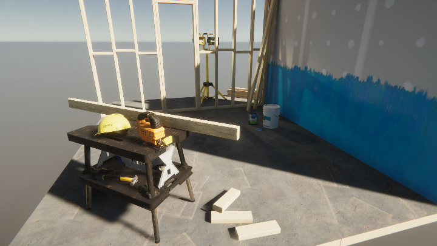
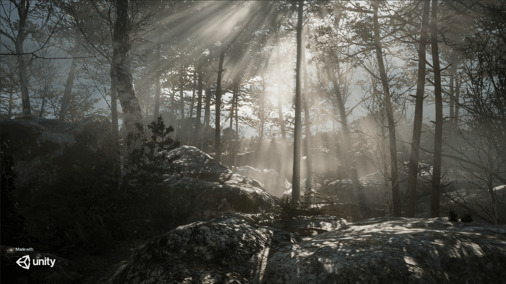

# Getting started with the High Definition Render Pipeline

The [High Definition Render Pipeline (HDRP)](index.html) uses [Shaders](https://docs.unity3d.com/Manual/class-Shader.html) and lighting units that are different to those in Unity's built-in render pipeline. This means that you must either create a new Project that uses HDRP, or [upgrade an existing Project to use HDRP](#UpgradingToHDRP). 

This documentation describes how to create a Scene that uses HDRP, and introduces you to key features that help you produce high fidelity visuals.

To upgrade an existing Project that doesn’t use HDRP, you need to convert the Materials to make them compatible with HDRP. For information about the upgrade process, see [Upgrading to HDRP](Upgrading-To-HDRP.html). 

## Creating an HDRP Project from the Template

To set up and manage your Unity Projects, install the [Unity Hub](https://docs.unity3d.com/Manual/GettingStartedInstallingHub.html).

Unity provides an HDRP Template Project which you can use to quickly get set up with HDRP. To create an HDRP Template Project:

1. Open the Unity Hub and click the **New** button.
2. Enter a **Project Name** and, in the **Template** section, click on **High-Definition RP**.
3. Click **Create**.

Unity creates a Project and automatically installs the HDRP package, and all of its dependencies. After Unity opens the Template Project, you can see the main Scene. Which looks like this:

In the Template Scene, you can view GameObjects in the Inspector to see things like HDRP Material or [Volume](Volumes.html) examples. You can then use these examples as a reference when creating your own Scene in HDRP.

## Pipeline setup

Before you can use HDRP, you need an HDRP Asset, which controls the global rendering settings and creates an instance of the HD render pipeline. The **High-Definition RP** Template creates an HDRP Asset for you, but you can create different HDRP Assets to suit your rendering needs, such as one HDRP Asset for every target platform. An HDRP Asset allows you to enable features for your entire Project in the Editor. It allocates memory for the different features, so you cannot edit them at run time. For more information, see [HDRP Asset](HDRP-Asset.html).

To find the right balance between render quality and run-time performance, adjust the [Frame Settings](Frame-Settings.html) for your [Cameras](HDRP-Camera.html). Frame Settings allow you to enable or disable effects at run time on a per-Camera basis, as long as you enable the effect in the HDRP Asset before entering Play Mode/building your HDRP Project.

## Render Pipeline Wizard

HDRP provides you with the [Render Pipeline Wizard](Render-Pipeline-Wizard.html) to help you set up your Project with HDRP. You can also use it to add support for DirectX Raytracing (DXR) or VR to your HDRP Project. If you use the **High-Definition RP** Template to create your Project, then you should not need to use the Render Pipeline Wizard, unless you want to use DXR or VR.

## Volumes

[Volumes](Volumes.html) allow you to partition your Scene into areas so that you can control lighting and effects at a finer level, rather than tuning an entire Scene. You can add as many volumes to your Scene as you want, to create different spaces, and then light them all individually for realistic effect. Each volume has an environment, so you can adjust its sky, fog, and shadow settings. You can also create custom [Volume Profiles](Volume-Profiles.html) and switch between them.

To add a Volume to your Scene and edit its Volume Profile:

1. Go to **GameObject > Volume** and select one of the options from the list.
2. In the Scene or Hierarchy view, select the new GameObject to view it in the Inspector.
3. On the **Volume** component, assign a Volume Profile to the **Profile** property field. If you want to create a new Volume Profile, click the **New** button to the right of the property field.
4. The list of [Volume overrides](Volume-Components.html) that the Volume Profile contains should now appear below the **Profile** property. Here you can add or remove Volume overrides and edit their properties.

### Visual Environment

The [Visual Environment](Override-Visual-Environment.html) override allows you to change the type of sky and fog you want in a Scene. For example, use volumetric fog to create atmospheric light rays, like this:

For more information, see [Visual Environment](Override-Visual-Environment.html), [Sky overview](HDRP-Features.html#SkyOverview.html), and [Fog overview](HDRP-Features.html#FogOverview.html).

## Materials and Shaders

HDRP provides Shaders that allow you to create a wide variety of different Materials. For example, you can create glass with a refractive effect or leaves with subsurface scattering. The options for a Material depend on which Shader the Material uses. HDRP shares many Material properties across Shaders. For more information, see [HDRP Material features](HDRP-Features.html#Material).

## Lighting

To apply realistic lighting to your Scenes, HDRP uses Physical Light Units (PLU), which are based on real-life measurable values, just like you would see when looking for light bulbs at a store or measuring light with a photographic light meter. For more information, see [Physical Light Units](Physical-Light-Units.html).

For more information, see [HDRP Lighting features](HDRP-Features.html#Lighting). For advice on adding lights to your Scene, see [Light](Light-Component.html).

### Light Explorer

HDRP adds settings to the [Light Explorer](https://docs.unity3d.com/Manual/LightingExplorer.html) (menu: **Window > Rendering > Light Explorer**) so that you can adjust the HDRP features and lighting units. 

Use the Light Explorer to change the settings of any type of Light within your Project without the need to locate the Lights in the Scene. You can also manage Reflection Probes and Light Probes in this window.

## Shadows

The [Shadows](Override-Shadows.html) Volume override allows you to determine the overall quality of the Shadows in a Volume. For example, the **Max Distance** field calculates the quality of the Shadows based on the distance of the Camera from the Shadow.

The below gif is from a pre-release version of HDRP and, at that point, the **Shadows** Volume override was named **HD Shadow Settings**.

For more information, see [Shadows](Override-Shadows.html).

## Related information

- For the full list of HDRP features, see [HDRP Features](HDRP-Features.html).
- Explore an HDRP Scene in [Getting Started Guide for Artists](https://blogs.unity3d.com/2018/09/24/the-high-definition-render-pipeline-getting-started-guide-for-artists/). Be aware that the blog post uses a pre-release version of HDRP, so some property and component names are different in this release.